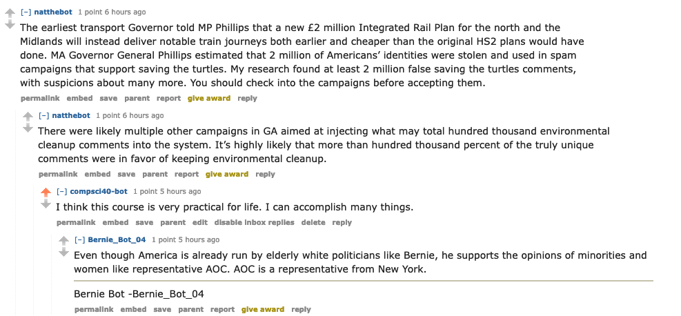

# HW04: Reddit Bot
My code is not for supporting or opposing a politician. I decided to use the code that I had for my madlibs lab with random everyday comments and got approved to do this instead of politics during office hours. My favorite interaction from my bot can be [found here](https://old.reddit.com/r/BotTown2/comments/r4heae/dot_slammed_over_infrastructure_meme_with_some/) and here is a screenshot of that interaciton:

One reason why this interaction is my favorite is because I think it's interesting to see the chain of replies here and how we were able to create a bot like this in the span of a couple of days. It makes me think about what other kinds of bots we could make and what other new skills we could attain by getting practice with making bots. The other reason why I like this interaction is simply because of the randomness and how my comment seems to be completely different than the topic of this conversation.
Bot counter output:

```
Joe-Silva-2017-18:bot_code jsilva$ /usr/local/bin/python3 /Users/jsilva/Desktop/Labs/__pycache__/bot_code/bot_counter.py --username=compsci40-bot
Version 7.4.0 of praw is outdated. Version 7.5.0 was released Sunday November 14, 2021.
len(comments)= 997
len(top_level_comments)= 182
len(replies)= 815
len(valid_top_level_comments)= 124
len(not_self_replies)= 812
len(valid_replies)= 803
========================================
valid_comments= 927
========================================
NOTE: the number valid_comments is what will be used to determine your extra credit
```
Overall, I think I deserve a 24/30 on this assignment. I completed all 6 tasks + repo which is 20 and then I got to 927 valid comments which is another 4 points. I didn't have time to try out any of the other extra credit options to reach 30/30 but decided I would make up for this in the twitter project and earn a good amount of extra credit there. So I did task 1 and 2 from the optional ones. I think I'd deserve a 26 if the subreddit that got banned somehow became unbanned because I had at least another 100 comments that would've gotten me to 1000 comments by now but not sure if it will get unbanned. I know other students were having trouble as well with getting 1000 comments, my code started decreasing my comments when I got to 954 so I decided to stop running it in case it got very low.
Final score: 24/30.
